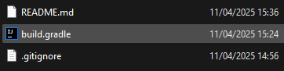
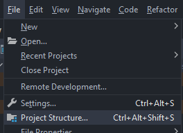
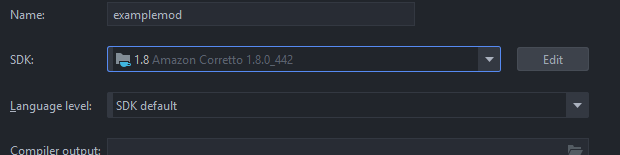
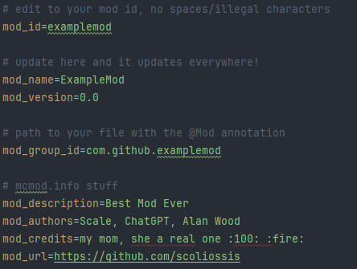
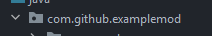
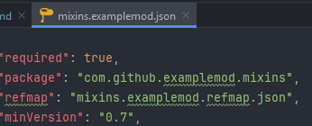
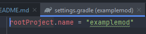

<!-- markdownlint-disable-file MD001 MD033 -->
<h1 align="center"><a href="https://github.com/scoliossis">scoliossis</a>/<a href="https://github.com/scoliossis/Forge-1.8.9-Mod-Base">Forge 1.8.9 Base</a></h1>
<p align="center">bestest base in all the land</p>
<div align="center">
   
</div>

## Setup
1. Clone the repo
   ```sh
   git clone https://github.com/scoliossis/Forge-1.8.9-Mod-Base
   ```
2. Open `build.gradle` in IntelliJ IDEA

   
3. Open Project Structure

   

   Set the SDK to any version of the Java 1.8 JDK

   
4. Use the "runClient" task to launch the game!

## Rebranding
1. Change the properties in gradle.properties to your own branding



2. Refactor the mod group id (com.github.scoliossis) using intellij, to be your "mod_group_id" in gradle.properties



3. Replace "examplemod" in the name of mixins.examplemod.json (src/main/rescources) with your mod id from gradle.properties 
   
   Replace the "package" element in mixins.examplemod.json with your mod_group_id.mixins
   
   Replace "examplemod" in the "refmap" with your mod_id



4. Rename the "rootProject.name" in settings.gradle to whatever you want your project name to be!



5. done <3

## Usage
Example Module

```java
package com.github.scoliossis.modules.impl.client;

import com.github.scoliossis.modules.Category;
import com.github.scoliossis.modules.Module;
import com.github.scoliossis.modules.RegisterModule;
import com.github.scoliossis.modules.RegisterSubModule;
import com.github.scoliossis.events.SubscribeEvent;
import com.github.scoliossis.events.impl.PlayerUpdateEvent;

@RegisterModule(
        name = "Module Name",
        description = "Module Description",
        category = Category.CLIENT,
        enabledByDefault = true
)
public class ModuleName extends Module {
   @RegisterSubModule(name = "Example Sub Module")
   public boolean exampleModule = false;

   @RegisterSubModule(
           name = "Example Sub Module with Parent",
           parent = "Example Sub Module",
           description = "This sub module is only shown when exampleModule is true"
   )
   public boolean exampleModuleWithParent = false;

   @RegisterSubModule(name = "Example Enum")
   public ExampleEnum exampleEnum = ExampleEnum.Mode;

   public enum ExampleEnum {
      Mode,
      Mode_2,
      Evil_Mode
   }

   @RegisterSubModule(
           name = "Example Slider with Enum Parent",
           parent = "Example Enum",
           modeParentString = {"Mode_2", "Evil_Mode"},
           description = "This sub module is only shown when exampleEnum is Mode_2 or Evil_Mode",
           min = 50,
           max = 500,
           increment = 25
   )
   public double exampleSlider = 0;

   @SubscribeEvent(priority = 1)
   public static void onPlayerUpdateEventHEAD(PlayerUpdateEvent event) {
      System.out.println("This is called first! and also only called if the module is enabled.");
   }

   @SubscribeEvent
   public static void onPlayerUpdateEvent(PlayerUpdateEvent event) {
      System.out.println("This is called middle! (default priority is 1000)");

      switch (exampleEnum) {
         case Mode:
            System.out.println("Example Slider is hidden right now, try changing the enum value.");
            break;
      }
   }

   @SubscribeEvent(priority = 9999)
   public static void onPlayerUpdateEventTAIL(PlayerUpdateEvent event) {
      System.out.println("This is called last!");
   }

   @Override
   protected void onEnable() {
   }

   @Override
   protected void onDisable() {
   }
}
```

## Features
- RenderUtil using opengl
- Font renderer - probably needs improving
- Module system
- .commands (toggle, set, bind, help, list, config)
- Fast event bus
- events (playertick, render, module enabled/disable, keypressed, etc.)
- Accessors
- Basic example modules
- Notifications
- Mixins support
- A bunch of util classes to help!
- Basic click GUI (look terrible, open to pr <3)